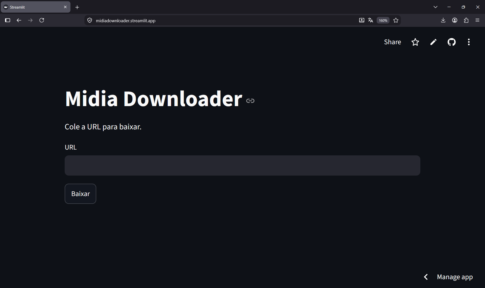

# MIDIA DOWNLOADER



Projeto simples em Python para baixar mídia pela URL usando `yt_dlp` com interface em `Streamlit`.

Deploy: https://midiadownloader.streamlit.app/

Ele foi pensado para facilitar o download de conteúdos como:

- Reels e posts do Instagram
- Vídeos do TikTok
- Imagens do Pinterest
- Lives e vídeos da Twitch
- Outros sites suportados pelo `yt_dlp`

## Funcionalidades

- Download de mídia apenas com a URL
- Interface simples em navegador
- Download direto para o navegador
- Salva arquivo temporariamente e inicia o download normalmente

## Requisitos

- Python 3.8+
- `yt_dlp`
- `streamlit`

## Instalação

1. Abra o terminal na pasta do projeto.

2. Instale as bibliotecas:

```bash
pip install yt-dlp streamlit
```

3. Execute a aplicação:

```bash
streamlit run link.py
```

## Como usar

1. Abra o navegador que o Streamlit abrir.
2. Cole a URL da mídia no campo indicado.
3. Clique em "Baixar".
4. O download será iniciado diretamente no navegador.

## Observações

- O YouTube não funciona neste deploy por limitações de ambiente e bloqueios da plataforma.
- O Projeto funciona melhor com uso local pois como o deploy usa ip de data center o youtube bloqueia.
- Use apenas em conteúdos permitidos e conforme as regras do serviço.
